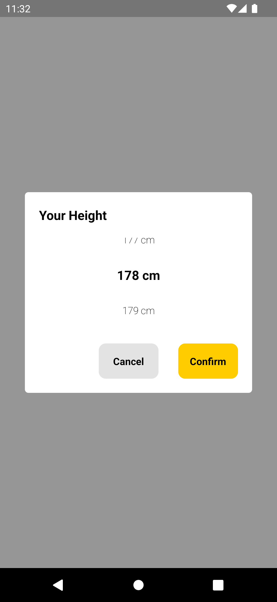
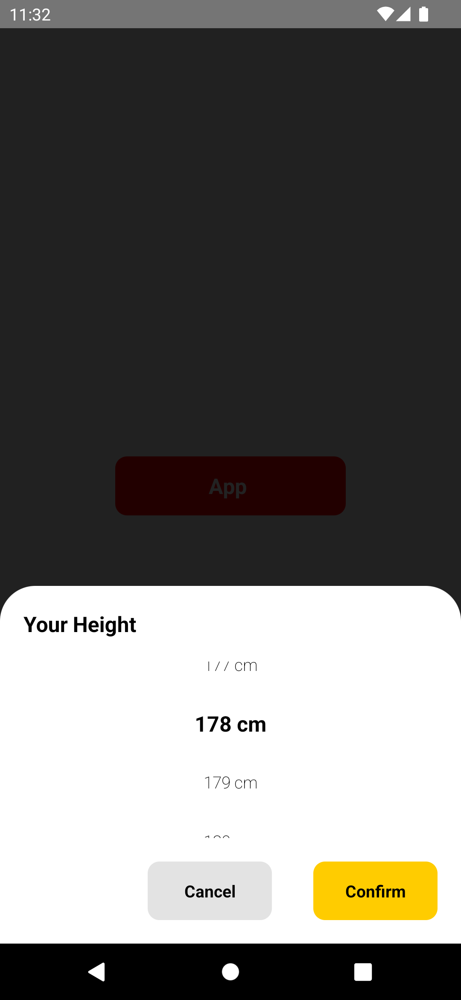

# rn-value-picker

React native value picker is a simple measurement's unit value picker with defined range .

## Installation

Install rn-value-picker with npm

```bash
  npm install rn-value-picker
```

## Usage

## How to use ? :thinking:

```jsx
import { View, Text, TouchableOpacity } from "react-native";
import React, { useState } from "react";
import ValuePicker from "rn-value-picker";

const App = () => {
  //states
  const [showPicker, setShowPicker] = useState(false);
  const [myHeight, setMyHeight] = useState("");
  //UI
  return (
    <View
      style={{
        flex: 1,
      }}
    >
      <View
        style={{
          flex: 1,
          justifyContent: "center",
          alignItems: "center",
        }}
      >
        <TouchableOpacity
          onPress={() => setShowPicker(true)}
          style={{
            height: 50,
            backgroundColor: "red",
            justifyContent: "center",
            alignItems: "center",
            width: "50%",
            borderRadius: 10,
          }}
        >
          <Text
            style={{
              color: "white",
              fontSize: 18,
              fontWeight: "bold",
            }}
          >
            App {myHeight}
          </Text>
        </TouchableOpacity>
      </View>
      {/* use here before last view end  */}
      <ValuePicker
        visible={showPicker}
        setVisibility={setShowPicker}
        Title="Your Weight"
        unit="kg"
        minValue={20}
        maxValue={150}
        setValue={setMyHeight}
      />
    </View>
  );
};

export default App;
```

## Screenshots





### List of props that you can use :-

| **#** | **Props**              | **Description**                                         | **Required** | **Example**                                                             |
| ----- | ---------------------- | ------------------------------------------------------- | ------------ | ----------------------------------------------------------------------- |
| 1     | visible                | Modal only: Boolean indicating if modal should be open. | Yes          | state value as true or false                                            |
| 2     | setVisibility          | for closing modal                                       | Yes          | setVisibility={setState}                                                |
| 3     | setValue               | setState in which you want to select value              | Yes          | setValue={yourState}                                                    |
| 4     | unit                   | Unit in which value measure                             | Optional     | "kg","cm","m" whatever just pass as string                              |
| 5     | Title                  | Title of your modal                                     | Optional     | pass as a String Title="Your Weight"                                    |
| 6     | minValue               | minimum value for measurement                           | Optional     | default 100 pass value Integer                                          |
| 7     | maxValue               | minimum value for measurement                           | Optional     | default 200 pass value Integer                                          |
| 8     | cancelButtonText       | text value if you want to change cancel text            | Optional     | default "cancel" if you want to change cancelButtonText="Your String"   |
| 9     | cancelButtonStyle      | style prop of cancel button view                        | Optional     | cancelButtonStyle={{...your custom style}}                              |
| 10    | cancelButtonTextStyle  | style prop of cancel button text                        | Optional     | cancelButtonTextStyle={{...your custom style}}                          |
| 11    | confirmButtonText      | text value if you want to change confirm text           | Optional     | default "confirm" if you want to change confirmButtonText="Your String" |
| 12    | confirmButtonStyle     | style prop of confirm button view                       | Optional     | confirmButtonStyle={{...your custom style}}                             |
| 13    | confirmButtonTextStyle | style prop of confirm button text                       | Optional     | confirmButtonTextStyle={{...your custom style}}                         |
| 14    | position               | position of modal                                       | Optional     | "center" and "bottom" default "center"                                  |

## Authors

- [@lalitpatel11](https://github.com/lalitpatel11)
